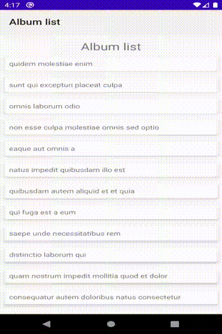

Sample app using recommended practices for Android apps and making use of [Architecture Components](https://developer.android.com/topic/libraries/architecture/).

This app uses the following libraries and technologies:

- Kotlin + Coroutines
- Architecture Components
  - LiveData
  - DataBinding
  - ViewModel
  - Room
  - Navigation
- Repository pattern with a remote and a local data source
- Retrofit for network calls
- Dagger2 for Dependency Injection
- JUnit4 and Mockito for testing
- Picasso for image loading

<!---->

  

